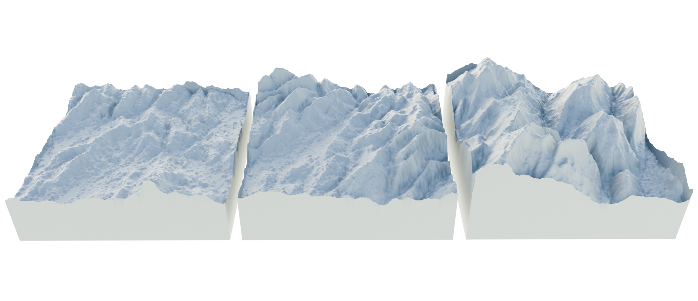

# topo_gan
Train a 1D DCGAN based on StyleGAN (https://arxiv.org/abs/1812.04948) on 2D heightmaps of the European Alps from the ASTER Global Digital Elevation Model V003 (https://www.earthdata.nasa.gov/) following the basic TensorFlow DCGAN tutorial (https://www.tensorflow.org/tutorials/generative/dcgan).

Heightmap dataset: Alps (N44E006-N48E015).

The latest snapshot was taken after 68 epochs, and much longer training is likely required. However, some heightmaps start to be acceptable. Below, three examples rendered using Blender 3D are shown:

